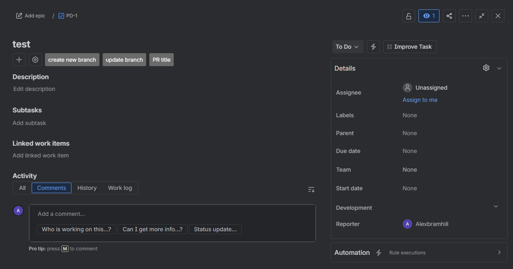
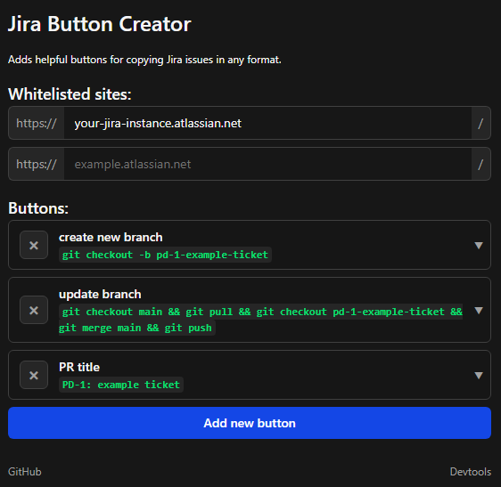
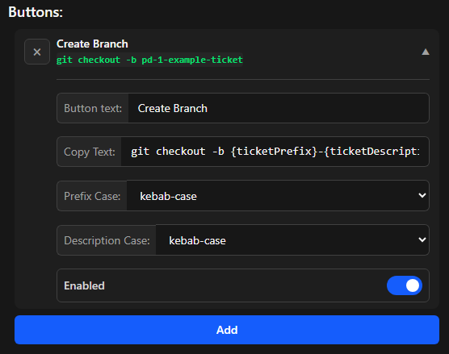
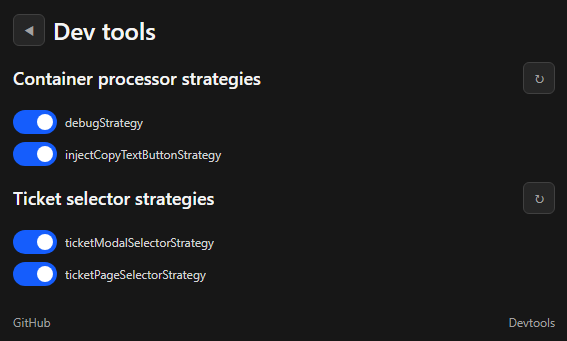

<div align="center">

</div>

# Jira Copy Buttons


A Chrome extension that adds buttons to Jira to easily copy Jira ticket identifiers and titles in a customisable format.

## Features

### Configure to your needs



- **Page Whitelisting**
- **Multiple button support**



- **Highly customisable button configuration**



- **Powerful developer mode**

## Installation

This extension is currently only available to install by building it yourself. Follow the development instructions to install.

## Usage

1.  Click the extension's icon in your Chrome toolbar to open the popup.
2.  Enter the base hostname of your Jira instance (e.g., `your-company.atlassian.net`).
3.  Navigate to any Jira issue page.
4.  The "Copy Branch Name" button will appear near the issue title.
5.  Click the button to copy the formatted branch name to your clipboard.

## Development

1.  **Clone the repository:**

    ```bash
    git clone https://github.com/AlexBramhill/jira-copy-buttons.git
    cd jira-copy-buttons
    ```

1.  **Install dependencies:**

    ```bash
    npm install
    ```

1.  **Build the extension:**

    Live rebuild:

    ```bash
    npm run dev
    ```

    or

    Static build:

    ```bash
    npm run build
    ```

    This will create a `dist` folder with the packed extension files. `dev` mode has live reloading to the build folder (note: extension still requires being reloaded in Chrome based on Chrome's requirements)

1.  **Load the extension in Chrome:**
    - Navigate to `chrome://extensions`.
    - Enable **Developer mode** using the toggle in the top-right corner.
    - Click the **Load unpacked** button.
    - Select the `dist` directory from this project.
